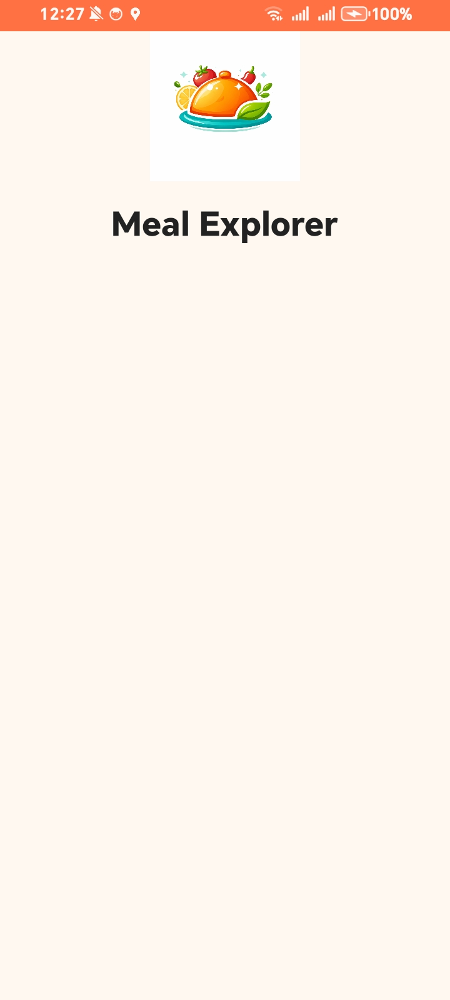
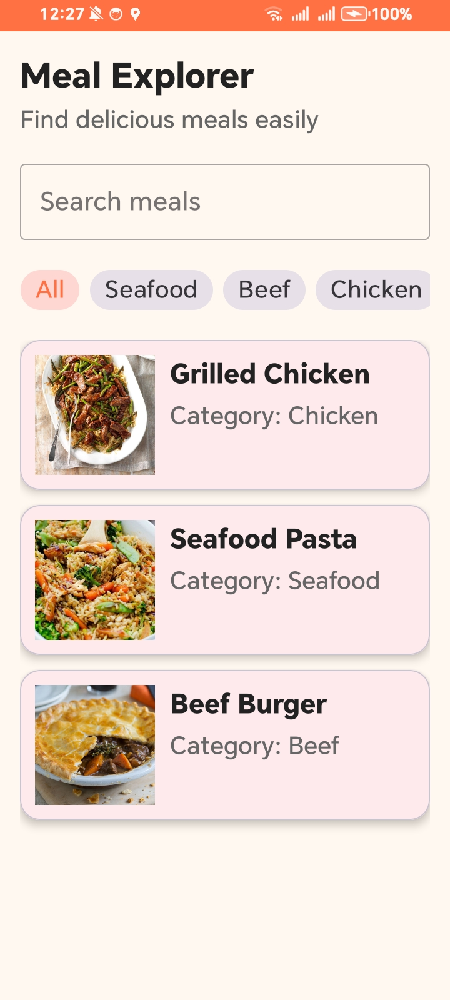

# 🍽️ Meal Explorer

Meal Explorer is a simple Android application built as part of a training plan to learn Android fundamentals using Kotlin and XML.

---

## 📱 Week 1 Scope

This week focuses on building the **UI and structure only**:

* Splash Screen
* Home Screen
* Search Bar UI
* Category Chips UI
* Meals List (RecyclerView)
* Mock Data (No API yet)

---

## 🛠️ Tech Stack

* Kotlin
* XML Layouts
* Fragments
* Navigation Component
* RecyclerView
* ViewBinding

---

## 🧠 Architecture

* Single Activity (MainActivity)
* Multiple Fragments (Splash, Home)
* Clean folder structure:

    * `ui` for UI layers
    * `data/model` for models

---

## 📸 Screenshots

### Splash Screen

### Home Screen

---

---

## ✨ Features

* Smooth Splash screen with logo
* Clean Home UI
* Search bar (UI only)
* Category chips (UI only)
* Meals list using RecyclerView
* Mock data implementation

---

## ⚠️ Limitations (Week 1)

* No API integration
* No search functionality
* No category filtering
* No details screen
* No state management

---

## 🚀 Next Steps

* Add Details Screen
* Implement Navigation to Details
* Introduce ViewModel
* Add Repository Layer
* Integrate API using Retrofit

---

## 👨‍💻 Author

Developed by [omar abdelgabbar]

---

## 📌 Notes

This is the **Week 1 delivery**, focused only on UI and basic app structure.
Future updates will include full functionality and API integration.
