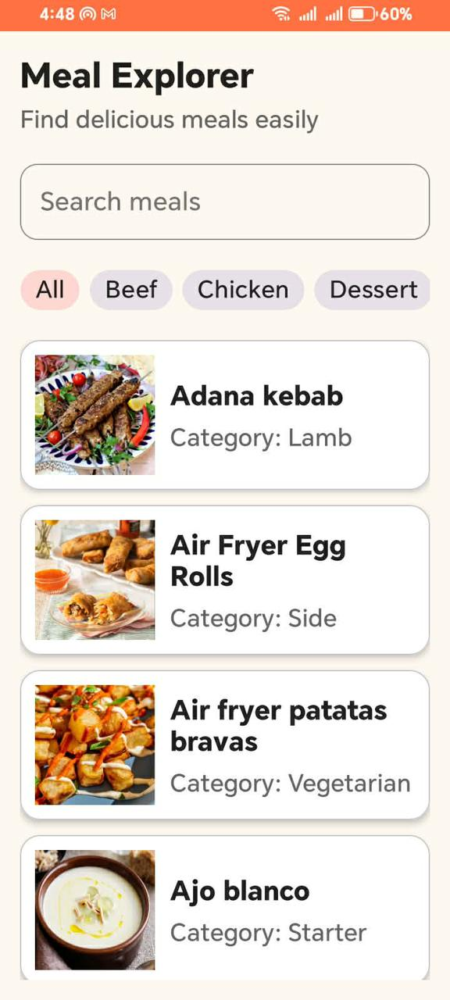
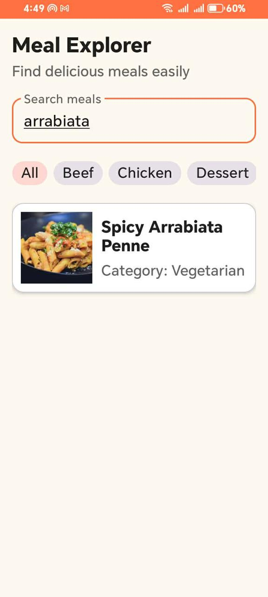
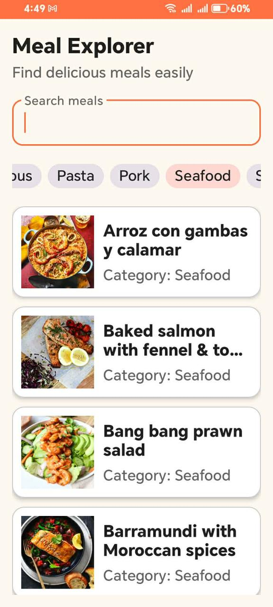
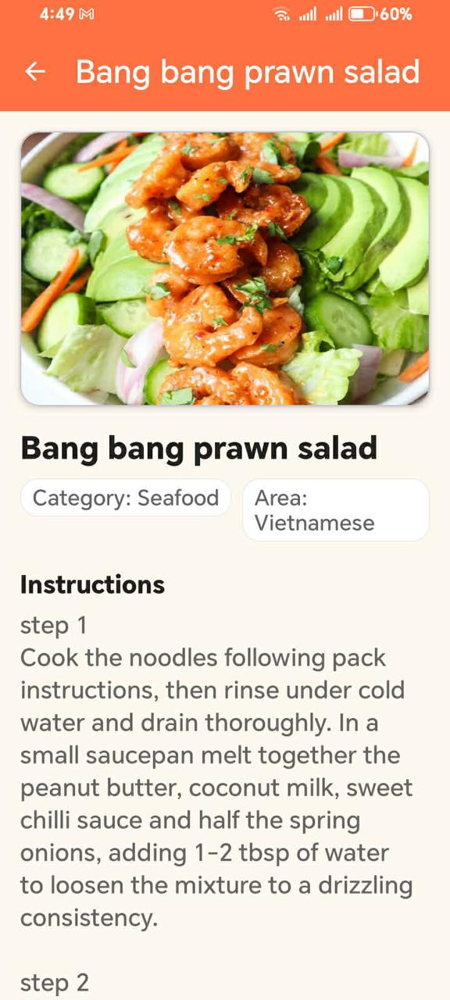

# Meal Explorer

Meal Explorer is a simple Android application built as a trainee project to practice Android fundamentals, XML UI, MVVM architecture, API integration, and clean project structure.

The app allows users to explore meals from TheMealDB API, search by meal name, filter meals by category, and view full meal details.

---

## Screenshots

### 1. Splash Screen


### 2. Home Screen


### 3. Search Result


### 4. Category Filter


### 5. Meal Details


---

## Features

- Splash screen
- Home screen with meal list
- Search meals by name
- Filter meals by category
- Meal details screen
- Loading state
- Empty state
- Error state with retry
- API integration using TheMealDB
- MVVM architecture
- Repository pattern
- XML-based UI
- RecyclerView meal list
- Navigation Component

---

## Tech Stack

- Kotlin
- XML Layouts
- MVVM
- Retrofit
- Coroutines
- Gson / Serialization
- RecyclerView
- ViewBinding
- Navigation Component
- Glide / Coil for image loading
- TheMealDB API

---

## API Used

This project uses TheMealDB public test API.

Base URL:

```text
https://www.themealdb.com/api/json/v1/1/

Main endpoints:
search.php?s=
lookup.php?i=
categories.php
filter.php?c=
search.php?f=a

App Flow

Splash Screen
      ↓
Home Screen
      ↓
Search / Category Filter
      ↓
Meal Details Screen

Project Structure

MealExplorer
├── app
│   ├── src/main/java/com/example/mealexplorer
│   │   ├── app
│   │   ├── data
│   │   │   ├── model
│   │   │   ├── remote
│   │   │   └── repository
│   │   ├── ui
│   │   │   ├── home
│   │   │   ├── details
│   │   │   └── splash
│   │   └── util
│   └── src/main/res
│       ├── layout
│       ├── navigation
│       ├── drawable
│       └── values

Architecture

The project follows a simple MVVM structure:

Fragment → ViewModel → Repository → API Service → TheMealDB API

Fragment

Responsible for displaying UI and observing data.

ViewModel

Handles screen logic and exposes UI state.

Repository

Handles data operations and communicates with the API layer.

API Service

Defines Retrofit API calls

Final Week Delivery

The final delivery includes:

Search functionality connected to real API
Meal details screen connected to real API
Category filtering using API data
Loading, empty, and error states connected to real responses
Complete end-to-end app flow
Final screenshots and demo video

How to Run
Clone the repository:
git clone https://github.com/os976/Meal-Explorer.git
Open the project in Android Studio.
Sync Gradle.
Run the app on an emulator or Android device.


Author

Omar Abdlegabbar

